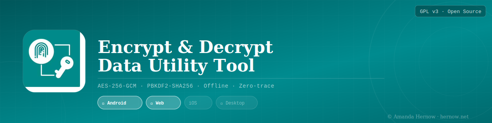

<p align="center">
  
</p>

<p align="center">
  
  
  
  
  
  
  
</p>

---

## About

**Encrypt & Decrypt Data Utility Tool** is a password-based text encryption and decryption utility built for privacy and simplicity. It lets you lock any message behind a password so that only someone with the correct password can read it. All cryptographic operations happen locally on your device — nothing is transmitted, logged, or stored.

The tool uses **AES-256-GCM** encryption combined with **PBKDF2-SHA256** key derivation (100,000 iterations), giving you strong, industry-standard security without needing a technical background to use it.

It was originally built as an internal utility tool and has since been rewritten as a standalone, open-source application available across multiple platforms.

---

## Platforms

| Platform | Status | Notes |
|---|---|---|
| **Android** | ✅ First release | Available on Google Play |
| **iOS** | 🔧 Work in progress | SwiftUI — not yet released |
| **Web** | 🔧 Work in progress | Standalone HTML — no server required |

This repository contains the source code for all three platforms. The **Android app is the first public release** and is the primary supported platform at this time.

---

## How It Works

### Encrypt
1. Open the app and tap **Encrypt**.
2. Enter the text you want to protect.
3. Enter a password.
4. The app produces an encrypted Base64 string. Copy it and send or store it however you like.

### Decrypt
1. Open the app and tap **Decrypt**.
2. Paste the encrypted Base64 string.
3. Enter the password that was used to encrypt it.
4. The original text is revealed if the password is correct.

> **Important:** If you forget your password, there is no way to recover the message. No one can reset or retrieve it.

---

## Security

| Property | Detail |
|---|---|
| **Encryption algorithm** | AES-256-GCM — authenticated encryption that protects confidentiality and detects tampering |
| **Key derivation** | PBKDF2-SHA256, 100,000 iterations — strengthens passwords against brute-force attacks |
| **Salt** | 16 bytes, randomly generated per encryption |
| **IV / Nonce** | 12 bytes, randomly generated per encryption |
| **Output format** | Base64-encoded blob: `[16-byte salt] + [12-byte IV] + [ciphertext + GCM tag]` |
| **Network access** | None — all operations are local and offline |
| **Storage** | No passwords, plaintext, or ciphertext are stored anywhere on the device |
| **Clipboard** | Clipboard writes are user-initiated only |

Random salt and IV per operation means the same input text with the same password will produce a different encrypted output every time, preventing pattern analysis.

---

## Project Structure

```
EncryptionDecryptionUtilityTool/
├── android/          # Android Studio project (Kotlin, API 26+)
├── ios/              # iOS project (Swift / SwiftUI) — work in progress
├── web/              # Standalone HTML tool — work in progress
├── docs/             # Images and assets used by this README
├── LICENSE           # GNU General Public License v3
└── README.md
```

---

## Building the Android App

**Requirements:**
- Android Studio Meerkat or newer
- Android Gradle Plugin 8.8.0+
- Kotlin
- Minimum SDK: API 26 (Android 8.0)
- Target SDK: API 35

**Steps:**

```bash
git clone https://github.com/AmandaHernow/EncryptionDecryptionUtilityTool.git
```

Then open Android Studio, choose **Open**, and navigate to the `android/` folder inside the cloned repository. Let Gradle sync complete, then run the app on an emulator or physical device.

---

## Support the Developer

If you find this tool useful, consider supporting its development. It helps keep the project maintained and free.

<p align="center">
  <a href="https://www.paypal.me/AmandaHernow">
    
  </a>
  <br/><br/>
  <a href="https://www.paypal.me/AmandaHernow">💙 Donate via PayPal</a>
</p>

You can also reach out or report issues at: **encrypt.decrypt.support@hernow.net**

---

## License

This project is licensed under the **GNU General Public License v3.0**.
You are free to use, modify, and distribute this software under the terms of that licence.
See the [LICENSE](LICENSE) file for the full text, or visit [gnu.org/licenses/gpl-3.0](https://www.gnu.org/licenses/gpl-3.0).

---

## Developer

**Amanda Hernow**
🌐 [hernow.net](https://hernow.net)
✉️ encrypt.decrypt.support@hernow.net

---

<p align="center">
  <sub>© 2026 Amanda Hernow — All rights reserved where applicable. Licensed under GPL v3.</sub>
</p>
